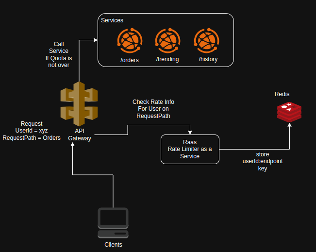

# Rate-limit-as-a-service AKA Raas
A dedicated microservice for rate limiting to check if users are within limits.


## Features

- **User-Specific Rate Limiting**: Limits requests per user per API endpoint.
- **Redis Integration**: Uses Redis as a fast and scalable key-value store.
- **Time Window Control**: Enforces rate limits within a defined time window.
- **HTTP 429 Response**: Returns a "Too Many Requests" response when limits are exceeded.
- **Configurable Limits**: Easily adjust request limits and time windows.

## Working Demo
<div >
  
</div>

## Architecture



[Architecture Edit Link](https://drive.google.com/file/d/1yVSM8zGEvzjBebzTH37iipqzIpmyStho/view?usp=drive_link)
## Requirements

- **Java 17**
- **Spring Boot 3.xx**
- **Redis** (Installed locally or accessible via Docker)
- **Maven** (for building the project)


## Setup and Installation

### 1. Clone the Repository

```bash
git clone https://github.com/avinash-550/rate-limit-as-a-service.git
cd backend/raas
```
### 2. Build and Run the Docker-Compose file

```bash
docker-compose up --build
```

### 3. Run the Spring boot Application
```bash
mvn spring-boot:run
```

## Usage

### Curl

```bash
curl -X GET "http://localhost:8082/api/limits" \
  -H "X-Request-Path: orders/history" \
  -H "X-User-ID: user123"
```

### Accessing UI
Open [index.html](frontend/index.html) in your favorite browser.

## API Design

### **Limits API**
- **Method**: `GET`
- **URL**: `/api/limits`
- **Header**: X-User-ID (Required)
- **Header**: X-Request-Path (Required)
- **Description**: Returns rate limits for the user on the given request path.
- **Response(s)**:
  ```json
    {
    "userId": "xyz",
    "remainingQuota": 2,
    "requestPath": "orders"
   }
  ```

## Configuration

| Environment Variable             | Default Value | Description                       |
|----------------------------------|---------------|-----------------------------------|
| `RATE_LIMITER_MAX_REQUESTS`      | `10`          | Maximum number of requests allowed per time window. |
| `RATE_LIMITER_TIME_WINDOW`       | `60`          | Time window in seconds for the quota refresh.         |


## How It Works

1. **Key Generation**:  
   Each user + `urlPath` combination generates a unique Redis key (e.g., `user123:test-endpoint`).

2. **Request Tracking**:
   - If the key does not exist, it is created with a count of `1` and an expiration time.
   - If the key exists, the counter is incremented.

3. **Rate Limiting**:
   - If the counter exceeds the maximum allowed requests, the API returns an HTTP 429 response.

4. **Reset**:
   - After the expiration time (e.g., 60 seconds), the Redis key is automatically removed, resetting the counter.


## To Do

-  Add contract tests.
-  Dockerize the application for easier deployment.

